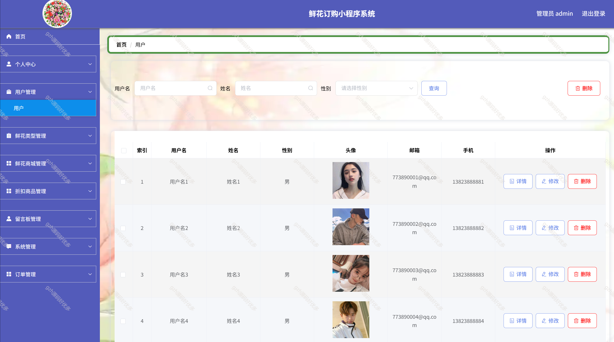

# mpweixinA081
mpweixinA081鲜花订购小程序
 
## 查看主页获取源码

### 一、关键词

鲜花商城小程序,鲜花订购小程序

### 二、作品包含

源码+数据库+万字文档+PPT+全套环境和工具资源+部署教程

### 三、项目技术

前端技术： vue2 Element-ui   Axios 
后端技术：python3.7.7,django2.0

  

### 四、运行环境（以下版本亲测，其他版本未知，请自测）

开发工具：IDEA/eclipse  + VSCODE + 微信开发者工具+HBuilder X

数据库：MySQL5.7

数据库管理工具：Navicat10以上版本

环境配置软件： python3.7.7 , django2.0

前端Nodejs：14

浏览器：谷歌浏览器

### 五、项目介绍

项目编号：mpweixinA081

人们的日常生活已经离不开网络。未来人们的生活与工作将变得越来越数字化，网络化和电子化。网上管理，它将是直接管理鲜花订购小程序系统的最新形式。本小程序是以构建鲜花订购小程序系统为目标，使用Python技术制作，前台由用户组成，后台由管理员对系统进行管理

系统主要包括首页，个人中心，用户管理，鲜花类型管理，鲜花商城管理，折扣商品管理，留言板管理，系统管理，订单管理等功能

### 六、运行截图

